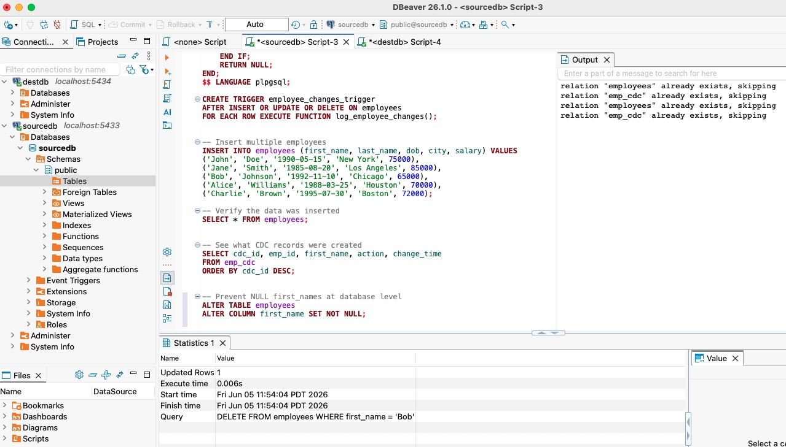
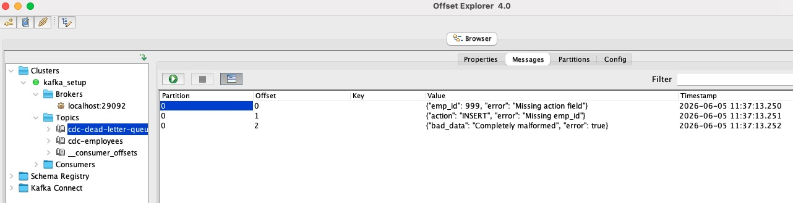

## CDC Kafka Pipeline with Idempotency, Avro Schema Registry, fault-tolerant consumer groups, DLQ analysis, Airflow and retry handling with exception monitoring.

## Project Overview

This repository implements a production-grade Change Data Capture (CDC) pipeline using Kafka, PostgreSQL, and Schema Registry. It is designed with resiliency and observability in mind, combining:

- Idempotent Kafka producers
- Avro Schema Registry compatibility and validation
- DLQ analysis and troubleshooting
- Fault tolerance through consumer groups and DLQ support
- Airflow orchestration for scheduled CDC execution
- Retry handling and exception monitoring

## Technology Stack

| Component | Technology | Version | Purpose |
| --- | --- | --- | --- |
| Message Broker | Apache Kafka | 7.4.0 | Stream processing |
| Coordination | Apache Zookeeper | 7.4.0 | Kafka cluster management |
| Schema Management | Confluent Schema Registry | 7.4.0 | Avro schema storage |
| Database | PostgreSQL | 14.1-alpine | Source & destination storage |
| CDC Mechanism | PostgreSQL Triggers | - | Automatic change tracking |
| Serialization | Avro + fastavro | - | Compact binary encoding |
| Workflow Orchestration | Apache Airflow | 2.7.1 | Scheduled producer execution |

## Key Features

### 1. Idempotent Producer

- Kafka-level idempotency (`enable_idempotence=True`) - Prevents duplicate messages during network retries.
- Application-level deduplication - Tracks processed message IDs using MD5 hashes.
- Exactly-once semantics - Guarantees each CDC record is sent exactly once.
- Uses message ID tracking to avoid application-level duplicates from repeated CDC reads.
- Order preservation (max_in_flight_requests_per_connection=1) - Maintains message sequence.

### 2. Schema Registry and Avro Validation

- Integrates Confluent Schema Registry to enforce a canonical Avro schema.
- Validates messages before sending to Kafka, preventing schema drift.
- Includes `schema/employee_schema.avsc` as the canonical Avro schema definition.
- Avro serialization - Compact binary format with schema evolution support
- Automatic validation - Rejects malformed messages before reaching Kafka.
- Backward/forward compatibility - Safe schema evolution without breaking consumer.

### 3. Dead Letter Queue (DLQ) and DLQ Analysis

- Failed messages are routed to `cdc-dead-letter-queue` for manual inspection.
- `test_dlq.py` is included to verify DLQ ingestion.
- `check_all.sh` provides a comprehensive health report with DLQ status, schema registry status, and consumer lag.
- Failed message isolation - Stores malformed messages without blocking pipeline. 
- Detailed error analysis - Captures specific failure reasons (missing fields, invalid types).
- Manual reprocessing - Ability to fix and replay failed messages.

### 4. Consumer Groups & Fault Tolerance

- 3 consumer instances - Load-balanced processing across partitions.
- Automatic partition assignment - Kafka handles distribution automatically.
- Horizontal scalability - Add/remove consumers without downtime.
- Monitors multiple consumer groups for independent downstream behavior:
  - `cdc-group`
  - `schema-consumer-group`
  - `fastavro-consumer-group`
- This design supports parallel validation paths and operational isolation across consumers.

### 5. Comprehensive Error Handling
- Retry mechanism - Automatic retries with exponential backoff.
- Transaction management - Atomic database operations with rollback on failure. 
- Connection pooling - Resilient database connections. 

### 6. Airflow Orchestration

- Includes an Airflow DAG at `dags/cdc_dag.py` to run CDC producer tasks on a schedule.
- `docker-compose-airflow.yml` boots Airflow services for orchestration and monitoring.
- Enables automated CDC execution with retries and scheduling.

### 7. Comprehensive Monitoring
- Real-time consumer lag tracking - Detects processing bottlenecks. 
- Schema Registry health checks - Validates schema availability. 
- DLQ monitoring - Tracks failed message counts. 
- End-to-end sync verification - Compares source vs destination counts. 

## Components

- `docker-compose.yml` - Kafka stack with Zookeeper, Kafka broker, Schema Registry, and PostgreSQL databases.
- `docker-compose-airflow.yml` - Airflow deployment for orchestration.
- `producers/cdc_producer.py` - CDC producer with idempotency, retries, and DLQ handling.
- `producers/cdc_producer_idempotent.py` - ID-based producer with offset tracking and duplicate prevention.
- `producers/cdc_producer_idempotent_schema.py` - Schema Registry-aware producer with Avro serialization.
- `consumers/cdc_consumer.py` - Generic consumer for CDC messages.
- `consumers/cdc_consumer_schema.py` - Schema-aware consumer that decodes Avro payloads and syncs dest_db.
- `dags/cdc_dag.py` - Airflow DAG to run the producer on a schedule.
- `check_all.sh` - Health and monitoring script for consumers, schema registry, and DLQ.
- `test_dlq.py` - DLQ tester that pushes sample messages into the dead letter queue.
- `schema/employee_schema.avsc` - Avro schema definition for CDC events.

## Architecture

1. `source_db` stores the source CDC table.
2. Producers read CDC records and write to Kafka topics.
3. Schema Registry validates Avro payloads and stores schema versions.
4. Consumers read Kafka events and apply changes into `dest_db`.
5. Failed Kafka processing is captured in the dead letter queue.
6. `check_all.sh` provides a single-pane status report.
7. Airflow schedules producer execution every 2 minutes.

## Tools & Visuals

- DBeaver: used for source and destination database inspection, SQL troubleshooting, and CDC table validation.


- Offset Explorer: used to monitor Kafka topics, consumer groups, partition lag, and message offsets.


## Setup

### Prerequisites

- Docker / Docker Compose
- Python 3.11+ or compatible
- `pip` packages:
  - `confluent-kafka`
  - `fastavro`
  - `avro-python3`
  - `requests`
  - `kafka-python`
  - `psycopg2-binary`

### Start the Kafka stack

```bash
cd project2-cdc
docker-compose up -d
sleep 15
```

### Start Airflow (optional)

```bash
docker-compose -f docker-compose-airflow.yml up -d
```

## Usage

### Run the producer once

```bash
cd project2-cdc
python producers/cdc_producer_idempotent.py --once
```

### Run the Schema Registry producer once

```bash
python producers/cdc_producer_idempotent_schema.py --once
```

### Run consumers

```bash
python consumers/cdc_consumer.py
python consumers/cdc_consumer_schema.py
```

### Test DLQ handling

```bash
python test_dlq.py
```

### Monitor pipeline health

```bash
./check_all.sh
```

### Stop and cleanup

```bash
./cleanup_all.sh
```

## Airflow

- Access Airflow UI at `http://localhost:8080`
- DAG: `cdc_producer_scheduler`
- The DAG runs `python cdc_producer.py --once` every 2 minutes.

## Recommended Next Steps

- Add schema compatibility tests for schema evolution.
- Extend the DLQ consumer to automatically reprocess valid retryable errors.
- Add Prometheus metrics or structured logs for production readiness.

---

Real-time status and health checks are available by running `./check_all.sh`.

============================================================
        CDC PIPELINE COMPREHENSIVE STATUS
============================================================

>>> CONSUMER GROUPS
------------------------------------------------------------

  Group: cdc-group
    Partition TOPIC: Offset=CURRENT-OFFSET | Lag=LAG | [FAIL] BACKLOG
    Partition cdc-employees: Offset=0 | Lag=0 | [OK] CAUGHT UP

  Group: schema-consumer-group
    Partition TOPIC: Offset=CURRENT-OFFSET | Lag=LAG | [FAIL] BACKLOG
    Partition cdc-employees-avro: Offset=1 | Lag=0 | [OK] CAUGHT UP
    Partition cdc-employees-avro: Offset=4 | Lag=0 | [OK] CAUGHT UP
    Partition cdc-employees-avro: Offset=1 | Lag=0 | [OK] CAUGHT UP

  Group: fastavro-consumer-group
    [WARN] Consumer group not active

>>> SCHEMA REGISTRY
------------------------------------------------------------
  [OK] Schema Registry running at http://localhost:8081
  Subjects: ["cdc-employees-avro-value"]
  Avro schema ID: 1 (version 1)

>>> SCHEMA VALIDATION ERRORS (Failed to write to Dest DB)
------------------------------------------------------------
  [OK] No schema validation errors detected

>>> DEAD LETTER QUEUE (Failed Kafka Messages)
------------------------------------------------------------
  [FAIL] 6 messages in Dead Letter Queue

  Sample messages:

>>> PRODUCER OFFSET
------------------------------------------------------------
  Last processed CDC record: 8
  [WARN] Offset mismatch detected

>>> END-TO-END SYNC
------------------------------------------------------------
  Source DB: 4 employees
  Dest DB:   6 employees
  [FAIL] Difference: -2 records
    Possible causes:
    - Records failed schema validation
    - Messages in Dead Letter Queue
    - Producer pending records

============================================================
                     SUMMARY OF FAILURES
============================================================
  [OK] Schema Validation: No failures
  [FAIL] Dead Letter Queue: 6 messages
  [FAIL] Sync Mismatch: -2 records difference

------------------------------------------------------------
[FAIL] PIPELINE DEGRADED - 2 issue(s) found
------------------------------------------------------------


